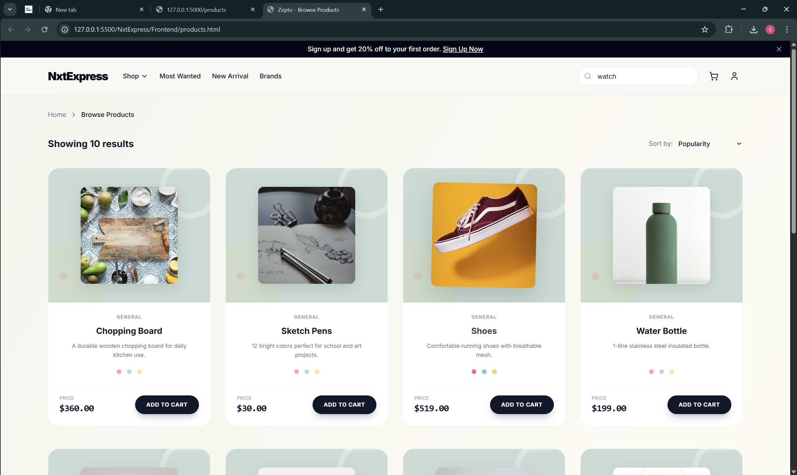

# Integrating Flask APIs in Frontend

This repository demonstrates how to integrate a Flask backend API with a frontend application to fetch and display dynamic data. The project fetches product information from a Flask server and renders it on a web page.

## Description

The application showcases a product listing page. The frontend makes HTTP requests to the Flask API endpoints to retrieve product details such as names, descriptions, prices, and images. This data is then used to dynamically generate the product cards on the page.

## Screenshot

Here is a screenshot of the final application showing products fetched from the API:

## Tech Stack

-   **Backend:** Flask (Python)
-   **Frontend:** HTML, CSS, JavaScript

## Setup Instructions

1.  Clone the repository.
2.  Navigate to the backend directory and install dependencies.
3.  Run the Flask server.
4.  Open the frontend HTML file in a web browser( edge for example).
